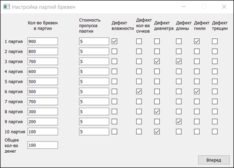
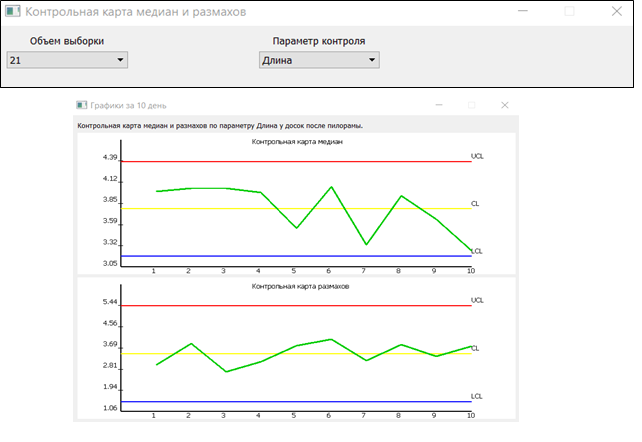
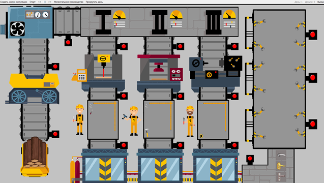

# Project description
A simulation-based training program designed for students studying statistical methods of product quality control.
Methods of statistical control are considered on the example of the production process of wooden interior doors. 
The production cycle has been shortened to make the material provided easier to understand.
The developed software is divided into two modules: teacher and student.

## Teacher module
Before running the enterprise simulation model, the teacher needs to set the parameters of the model. 
Parameters settings include the selection of broken machines, the selection of the defects and the number of processed products before the breakdown occurs.

### Teachers settings example

## Student module
The student get the program with a prepared script from the teacher. He does not know the parameters of the model.
The student needs to analyze the production process using quality control tools, find the reasons for the appearance of product defects and eliminate it.
The student has a certain amount of money and he needs to spend it on debugging the technological process.
The price for all types of student actions was set by the teacher when he prepared the script.

### Quality control tool example (Shewhart chart)

## Production cycle view

